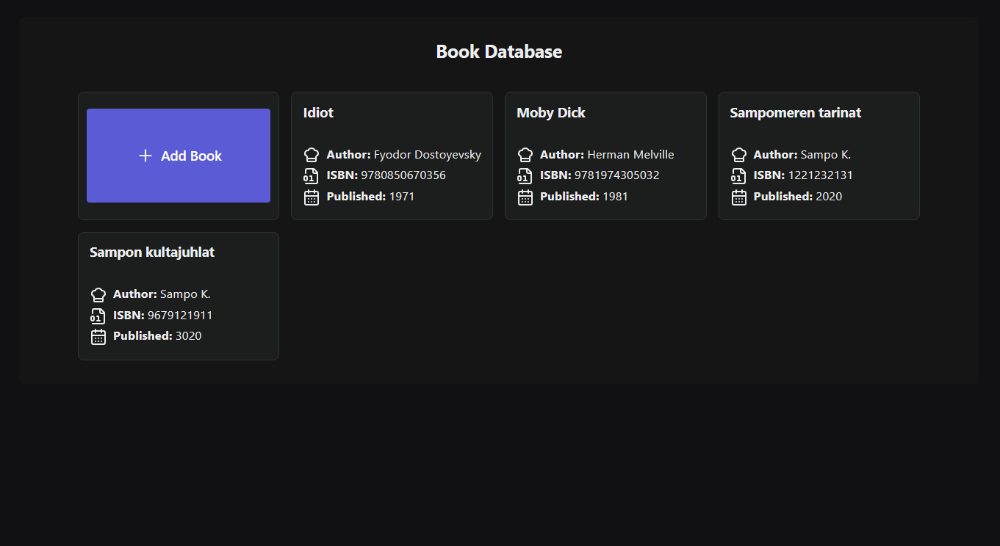

# Book Database App
A simple python application that uses a text file as a database and allows users viewing books stored in the file and adding new books to it.

# Requirements
1. Python (3.12 or later)
2. (optional) Create & activate virtual Python environment (in Windows by running `py -m venv venv` in the project root)
3. Install by running `pip install -r requirements` in the project root.

Programmed & tested on Windows but should also work with Linux based systems.

# Running
Run by using the provided launcher and passing the database file path. If the file does not exist, it will be created. There is an example `data.txt` file in the project root that you can try out.

F.ex. `python launcher.py my_database.txt`

After running the command you should see Reflex initialization and then a url pointing to the application GUI front-end (http://localhost:3000/).

If the port is in use by another application in your system, please change the port to the `rxconfig.py` file in the root (f.ex. frontend_port=3001).

To exit the app, close the browser window and CTRL + C to the server terminal.

Succesfully launced app should look like this:

# FAQ

## Reflex does not install
Please refer to https://reflex.dev/docs/getting-started/installation/ as per your system.

## Reflex and antivirus
Some antivirus software might prevent Reflex from installing packages from Github. Note that I did not do any malicious changes to Reflex and
you will install a clean version of it directly via original means of installation if you follow instructions in this file.

For me the solution was to run the launch command again and then it worked.

## Thing x does not work
Please email or call me (you know who I am :))

## What I wanted to do but had no time to
1. Unit tests for the database and front-end side.
2. Fine tune the code and make sure everything goes according to Reflex model.
3. Add validation error messages to the add new book dialog.
4. Fine tune the GUI for accessibility.

## Why didn't I just make a simple cmd app?
1. I wanted to make a GUI that could potentially be linked with and actual database later on.
2. I wanted to try out Reflex that I have not used before.
3. I wanted to make the "library view" based on cards.
